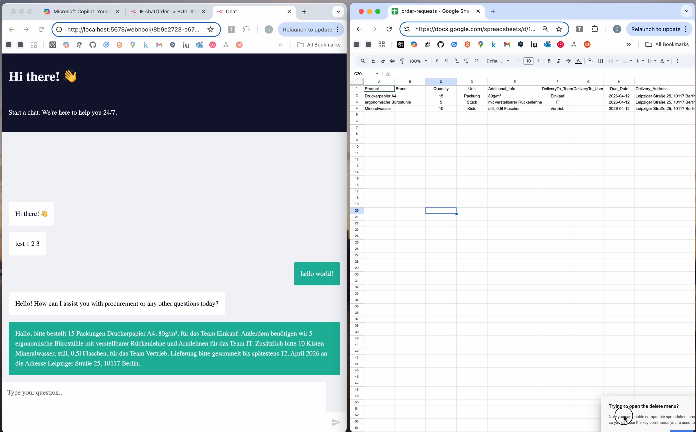

# Procurement-Agentic-AI

## Überblick

Dieses Projekt modernisiert Ihre Beschaffungsprozesse mit einem **modularen KI-Stack**.  
Ein eingebetteter Chat beantwortet Anfragen blitzschnell und nimmt Bestellung der Mitarbeiter ins System auf.

## 🎯 Ziele

- **Automatisierte Antworten** auf Standardanfragen  
- **Semantische Suche & Kontext-Engineering** via Vector DB

Hier geht’s zum Video auf Vimeo.com -> https://vimeo.com/1127977900?share=copy&fl=sv&fe=ci

## 💻 Tech Stack

- **Orchestrierung:** n8n  
- **Containerisierung:** Docker (n8n, Ollama lokal, PostgreSQL, Qdrant, ngrok)  
- **LLMs:**    
  - Extern: Mistral  
- **Datenhaltung:**  
  - Relational: PostgreSQL  
  - Semantisch: Qdrant (Vector-Store)
  - Tabellen: Google sheets
- **Tunnel & Webhooks:** ngrok  

## Einsatzszenarien

- **Anfragen:** automatisierte Aufnahme der Bestellwünsche der Mitarbeiter; von einfachen Anfrage über Chats wie Teams oder Slack zu strukturierten JSON Dateien.
- **Status-Abfragen:** Einsatz von AI um Fragen zu Status sowie weitere Details über Bestellungen zu beantworten.

## 📊 Executive Insights

- **Effizienzgewinn:** Weniger manuelle Tickets.
- **Konsistenz:** einheitliche Datenhaltung kann für Analysen besser verabeitet werden.
- **Transparenz:** hoch strukturierte Freigabeprozesse sind einfacher umzusetzen.

